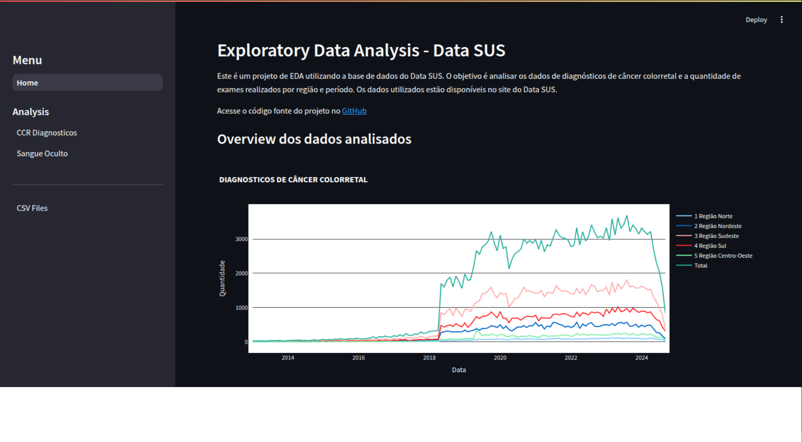
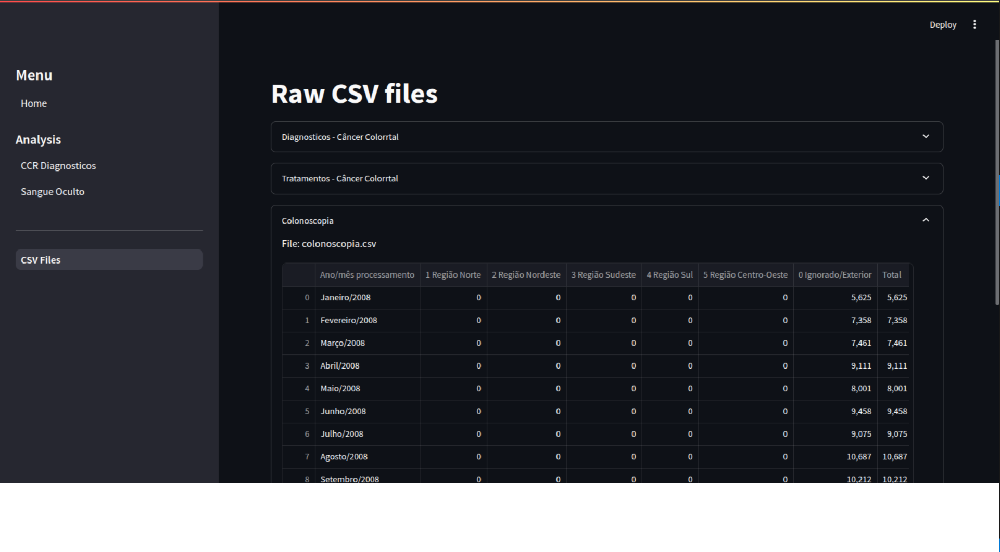

# Exploratory Data Analysis - Data SUS

This project performs an Exploratory Data Analysis (EDA) on some public health data. The goal is to analyze colorectal cancer diagnosis data and the number of tests performed by region and period. The data used is available on the SIA SUS website.

## Access the Application

You can access the application at the following link:
[Application](https://edadatasus.streamlit.app/)

Here are some screenshots of the application:

* #### Home Page
  
* #### CSV Files
  

## Installation

1. Clone the repository:
    ```bash
    git clone https://github.com/RenatoFleury/eda_data_sus.git
    cd eda_data_sus
    ```

2. Create a virtual environment and activate it:
    ```bash
    python3 -m venv .venv
    source .venv/bin/activate
    ```

3. Install the required packages:
    ```bash
    pip install -r requirements.txt
    ```

## Usage

To run the Streamlit app, use the following command:
```bash
streamlit run streamlit_app.py
```

## Project Structure
```
eda_data_sus
├── components
├── csv_files
├── pages
└── utils
```